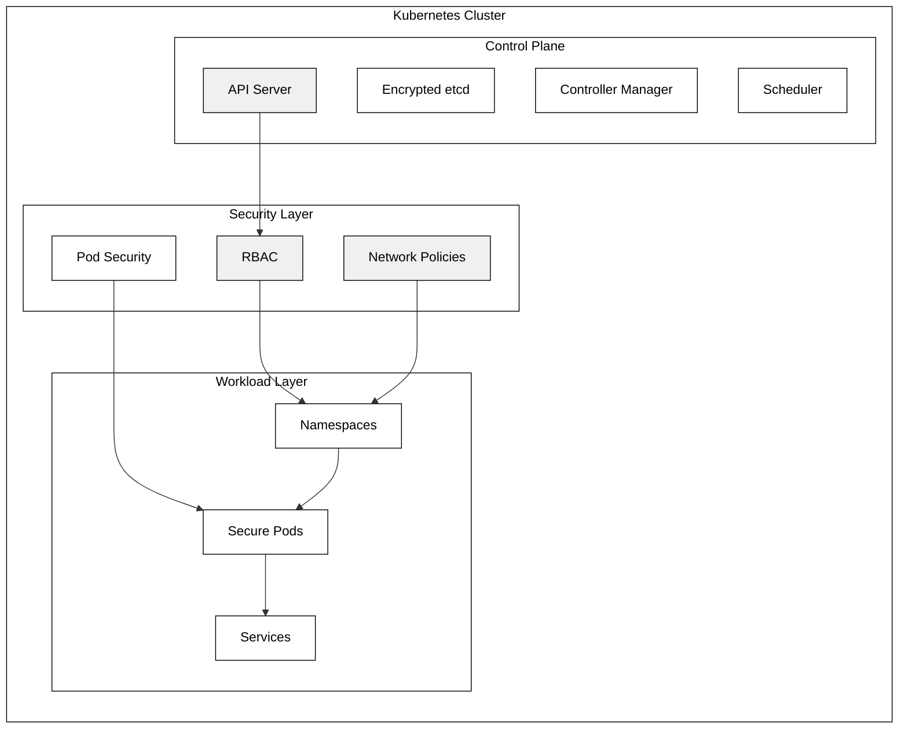

# secure-Kubernetes-architecture

flowchart TD
    subgraph "CI/CD Pipeline"
        A[Developer Push] --> B[Source Code Repository]
        B --> C[Code Security Scan]
        C --> D[Build Container Image]
        D --> E[Image Security Scan]
        E --> F[Sign Image]
        F --> G[Push to Registry]
        G -# Secure Kubernetes Architecture

## Kubernetes Security Architecture

## Secure CI/CD Pipeline

```mermaid
flowchart LR
    classDef default fill:#ffffff,stroke:#000000,color:#000000
    classDef highlight fill:#f0f0f0,stroke:#000000,color:#000000

    subgraph CI["Continuous Integration"]
        direction LR
        A["Code Push"]:::default
        B["Code Scan"]:::highlight
        C["Unit Tests"]:::default
        D["Build Image"]:::default
    end

    subgraph SEC["Security Gates"]
        direction LR
        E["SAST Scan"]:::highlight
        F["Dependency Scan"]:::highlight
        G["Image Scan"]:::highlight
        H["Sign Image"]:::highlight
    end

    subgraph CD["Continuous Deployment"]
        direction LR
        I["Image Registry"]:::default
        J["K8s Validation"]:::highlight
        K["Deploy"]:::default
        L["Health Check"]:::default
    end

    A --> B --> C --> D
    D --> E --> F --> G --> H
    H --> I --> J --> K --> L

    style CI fill:#ffffff,stroke:#000000,color:#000000
    style SEC fill:#ffffff,stroke:#000000,color:#000000
    style CD fill:#ffffff,stroke:#000000,color:#000000
```

## Security Components Details

### Kubernetes Security Controls
1. **API Server Security**
   - TLS encryption
   - Authentication
   - Authorization (RBAC)
   - Admission Controllers

2. **Workload Security**
   - Pod Security Standards
   - Container Security Context
   - Resource Limits
   - Network Policies

3. **Data Security**
   - Encrypted etcd
   - Encrypted Secrets
   - PV/PVC Encryption
   - Secure Communication

### CI/CD Security Controls
1. **Code Security**
   - Source Code Scanning
   - Secret Detection
   - Dependency Scanning
   - SAST Analysis

2. **Container Security**
   - Base Image Scanning
   - Vulnerability Scanning
   - Image Signing
   - Registry Security

3. **Deployment Security**
   - Manifest Validation
   - RBAC Enforcement
   - Network Policy Validation
   - Health Checks

## Implementation Notes

The architecture implements security at multiple layers:

1. **Development Security**
   - Code scanning
   - Dependency checking
   - Secret detection
   - Secure coding practices

2. **Build Security**
   - Secure base images
   - Multi-stage builds
   - Minimal container content
   - No root processes

3. **Runtime Security**
   - Pod security standards
   - Network isolation
   - Resource constraints
   - Health monitoring

4. **Infrastructure Security**
   - Control plane hardening
   - Node security
   - Network security
   - Monitoring and logging-> H[Deploy to K8s]
    end

    subgraph "Kubernetes Cluster"
        subgraph "Control Plane"
            API[API Server]
            ETCD[etcd - Encrypted]
            CM[Controller Manager]
            SCHED[Scheduler]
        end

        subgraph "Production Namespace"
            NET[Network Policies]
            PODS[Secured Pods]
            SVC[Services]
        end

        subgraph "Security Controls"
            RBAC[RBAC Policies]
            PSP[Pod Security Policies]
            NP[Network Policies]
        end

        API --> RBAC
        RBAC --> PODS
        PSP --> PODS
        NP --> NET
    end
