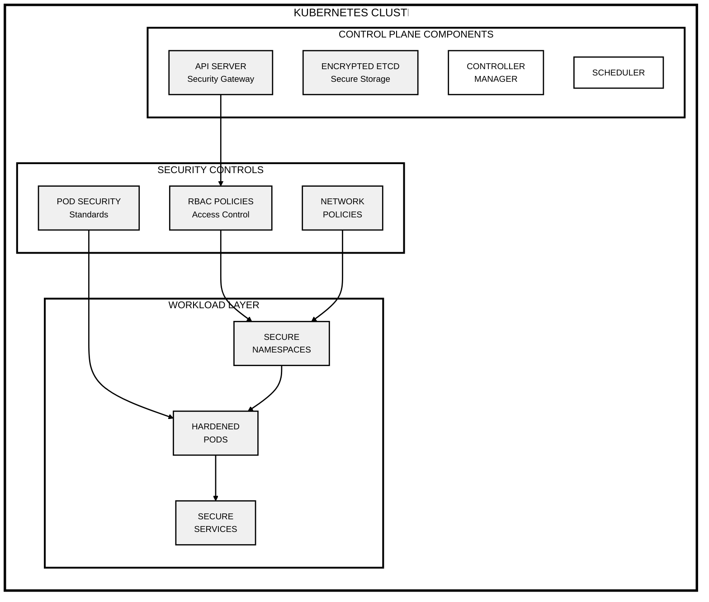

# Secure Kubernetes Architecture

## Kubernetes Security Architecture



## Secure CI/CD Pipeline

```mermaid
%%{init: {'theme': 'base', 'themeVariables': { 'fontSize': '16px', 'fontFamily': 'arial', 'lineWidth': '2px' }}}%%
flowchart LR
    classDef default fill:#ffffff,stroke:#000000,stroke-width:2px,color:#000000,font-size:14px
    classDef highlight fill:#f0f0f0,stroke:#000000,stroke-width:2px,color:#000000,font-size:14px
    classDef cluster fill:#ffffff,stroke:#000000,stroke-width:4px,color:#000000,font-size:16px

    subgraph CI["CONTINUOUS INTEGRATION"]
        direction LR
        A["CODE<br/>PUSH"]:::default
        B["SECURITY<br/>SCAN"]:::highlight
        C["UNIT<br/>TESTS"]:::default
        D["BUILD<br/>IMAGE"]:::default
    end

    subgraph SEC["SECURITY GATES"]
        direction LR
        E["STATIC<br/>ANALYSIS"]:::highlight
        F["DEPENDENCY<br/>SCAN"]:::highlight
        G["CONTAINER<br/>SCAN"]:::highlight
        H["IMAGE<br/>SIGNING"]:::highlight
    end

    subgraph CD["CONTINUOUS DEPLOYMENT"]
        direction LR
        I["SECURE<br/>REGISTRY"]:::highlight
        J["K8s CONFIG<br/>VALIDATION"]:::highlight
        K["SECURE<br/>DEPLOY"]:::highlight
        L["HEALTH<br/>CHECK"]:::default
    end

    A --> B --> C --> D
    D --> E --> F --> G --> H
    H --> I --> J --> K --> L

    style CI fill:#ffffff,stroke:#000000,stroke-width:4px,color:#000000,font-size:18px
    style SEC fill:#ffffff,stroke:#000000,stroke-width:4px,color:#000000,font-size:18px
    style CD fill:#ffffff,stroke:#000000,stroke-width:4px,color:#000000,font-size:18px

    linkStyle default stroke:#000000,stroke-width:2px
```




# Secure Kubernetes Architecture and CI/CD Pipeline

## Overview

This project focuses on designing a secure Kubernetes cluster and a CI/CD pipeline for deploying applications. It includes essential security measures throughout the architecture and deployment process.

## Components

### 1. Kubernetes Cluster Design
- **RBAC:** Implement Role-Based Access Control to manage user permissions.
- **Isolated Environments:** Use namespaces for different environments (e.g., dev, test, prod).
- **Pod Communication:** Limit pod-to-pod communication using Network Policies.
- **API Security:** Secure API access with HTTPS and authentication.

### 2. CI/CD Pipeline
- **Source Code Scanning:** Scan code for vulnerabilities before building.
- **Build & Push:** Build container images and push them to a secure registry.
- **Image Scanning:** Scan images for vulnerabilities before deployment.
- **Secure Deployment:** Deploy applications securely to the Kubernetes cluster.

## Getting Started
1. Clone the repository:
   ```bash
   git clone <repository-url>
   cd <repository-directory>
   ```

2. Set up your Kubernetes cluster following the [Kubernetes documentation](https://kubernetes.io/docs/setup/).

3. Configure and run your CI/CD pipeline using your preferred CI tool.

## Conclusion

This project establishes a secure foundation for Kubernetes applications and ensures that security is integrated into the CI/CD process.
