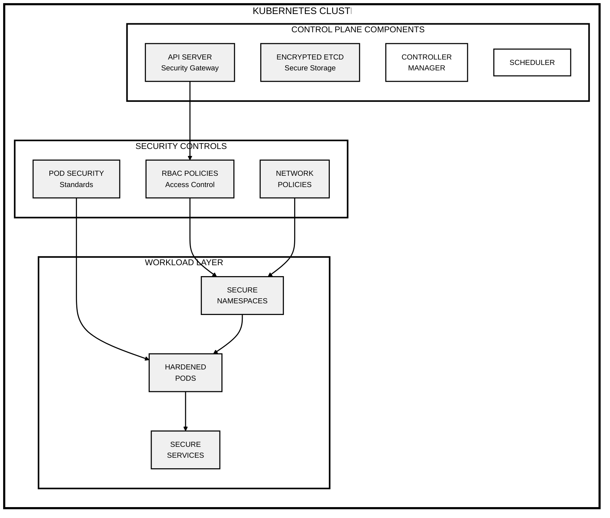

# Secure Kubernetes Architecture

## Kubernetes Security Architecture

## Secure CI/CD Pipeline

```mermaid
%%{init: {'theme': 'base', 'themeVariables': { 'fontSize': '16px', 'fontFamily': 'arial', 'lineWidth': '2px' }}}%%
flowchart LR
    classDef default fill:#ffffff,stroke:#000000,stroke-width:2px,color:#000000,font-size:14px
    classDef highlight fill:#f0f0f0,stroke:#000000,stroke-width:2px,color:#000000,font-size:14px
    classDef cluster fill:#ffffff,stroke:#000000,stroke-width:4px,color:#000000,font-size:16px

    subgraph CI["CONTINUOUS INTEGRATION"]
        direction LR
        A["CODE<br/>PUSH"]:::default
        B["SECURITY<br/>SCAN"]:::highlight
        C["UNIT<br/>TESTS"]:::default
        D["BUILD<br/>IMAGE"]:::default
    end

    subgraph SEC["SECURITY GATES"]
        direction LR
        E["STATIC<br/>ANALYSIS"]:::highlight
        F["DEPENDENCY<br/>SCAN"]:::highlight
        G["CONTAINER<br/>SCAN"]:::highlight
        H["IMAGE<br/>SIGNING"]:::highlight
    end

    subgraph CD["CONTINUOUS DEPLOYMENT"]
        direction LR
        I["SECURE<br/>REGISTRY"]:::highlight
        J["K8s CONFIG<br/>VALIDATION"]:::highlight
        K["SECURE<br/>DEPLOY"]:::highlight
        L["HEALTH<br/>CHECK"]:::default
    end

    A --> B --> C --> D
    D --> E --> F --> G --> H
    H --> I --> J --> K --> L

    style CI fill:#ffffff,stroke:#000000,stroke-width:4px,color:#000000,font-size:18px
    style SEC fill:#ffffff,stroke:#000000,stroke-width:4px,color:#000000,font-size:18px
    style CD fill:#ffffff,stroke:#000000,stroke-width:4px,color:#000000,font-size:18px

    linkStyle default stroke:#000000,stroke-width:2px
```

## Key Security Components

### Kubernetes Security Layers

🔒 **Control Plane Security**
- API Server Authentication & Authorization
- Encrypted etcd Storage
- Secure Controller Operations
- Protected Scheduler

🔒 **Workload Security**
- Pod Security Standards
- Container Hardening
- Resource Isolation
- Network Segmentation

🔒 **Access Control**
- RBAC Policies
- Service Accounts
- Namespace Isolation
- Secret Management

### CI/CD Security Controls

🔒 **Code Security**
- Source Analysis
- Dependency Scanning
- Secret Detection
- Compliance Checks

🔒 **Build Security**
- Container Scanning
- Image Signing
- Base Image Security
- Registry Protection

🔒 **Deployment Security**
- Configuration Validation
- Security Policy Enforcement
- Health Monitoring
- Access Controls

